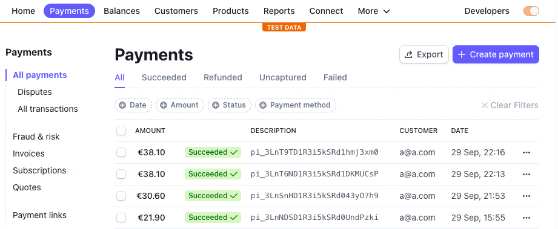
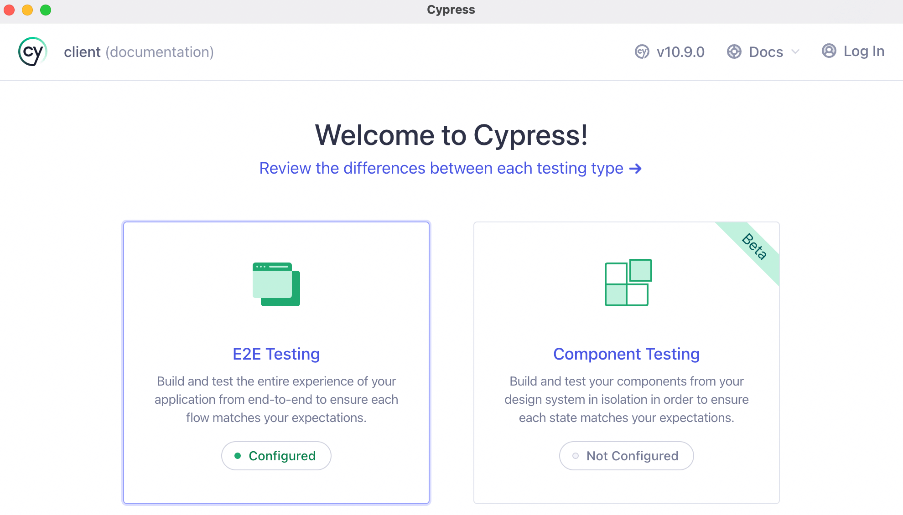
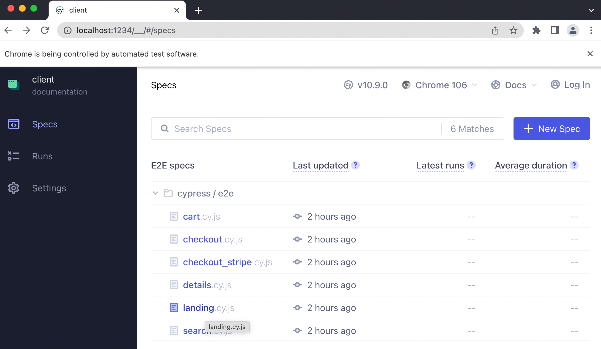
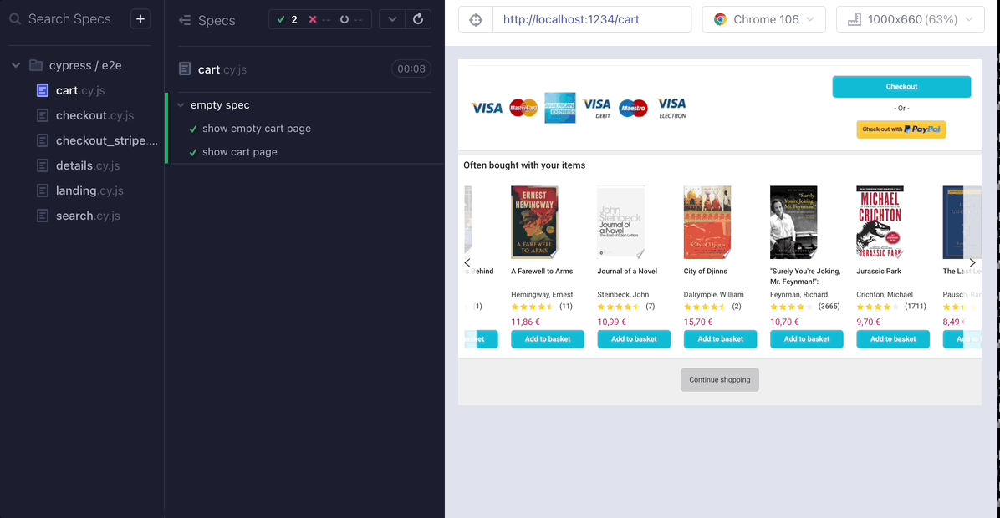
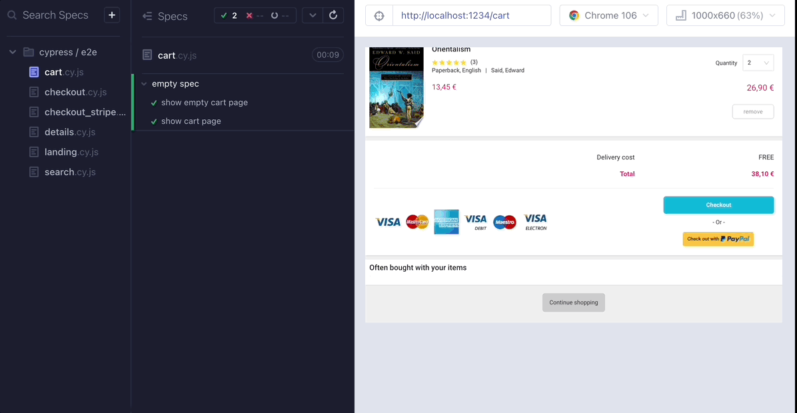

# Book shop e-commerce site

## Technologies
* [React](https://reactjs.org/)
* [Ant Design System](https://ant.design/components/overview/)
* [Create React App boilerplate](https://create-react-app.dev/)
* [Sass CSS preprocessor](https://sass-lang.com/)
* [Cypress e2e testing framework](#testing)
* [Stripe payment processing](#payment-processing-with-stripe)

## Screenshots

See application screenshots [here](../documentation/screenshots/client/README.md)

## Key Features

#### Real book data
Book data is fetched from [`Google Books API`](https://developers.google.com/books/docs/v1/using). The result contains extended information about each book from the original CSV file, including book cover image, list of authors, description, rating and number of reviews, publisher information, and current list price.  
This data is fetched once on the backend and stored in a JSON file `books.json`, which is now used to populate book results.

#### Search
Fully functional dual search functionality. First (more performant) search is run over cached items and the result is shown instantly. In addition a search request is sent to the backend API for advanced search including fields like description, ISBN, publisher, category to name a few. Once the search response is available, it will be shown to the customer by updating the search results 

#### Navigation
Header category navigation with additional scroll-to-category functionality

#### Marketing banner
Marketing banner embedded into a carousel is shown on the prominent position of the landing page. 
It can contain promotional information and featured books. 
The carousel automatically rotates every 10 seconds giving just enough time to check the content

#### Book carousel
Book carousel displays paginated results for every category, such as bestsellers, top rated books, fiction/non-fiction and other categories.  
It contains buttons on both sides to rotate the carousel content

#### Random recommendations
On the Book details page and cart page multiple carousel elements display book recommendations. 
First carousel contains books from the same category, while second carousel contains randomly picked books in order to promote them to the customer

#### Stripe checkout, real stripe data fetching
Stripe payment processing can be optionally added to enhance checkout experience. It must be connected to a test account with Stripe to not charge real credit cards. In addition, card validation is minimized for test accounts, so card numbers like `4242 4242 4242 4242` can be used.  
Stripe checkout is split in three steps:
1. User enters payment details using fancy UI 
2. Payment details are sent to server backend in order to generate so-called payment intent, which should return a payment key valid for this specific purchase. 
3. Client issues payment confirmation request to Stripe including billing details entered by the customer. Once the payment is verified and accepted, Stripe responds with unique payment ID, which can be also used as order ID.

Stripe publishable key should be added to `.env` in order to activate payments with Stripe

#### Simple checkout
If no Stripe account is available, checkout will simply validate address fields and then activate a `Buy now` button, which will generate fake order object along with random order ID.  
No payment details are requested, as it would add additional security concerns otherwise

#### Shopping basket dynamic functionality
* Basket functionality is fully dynamic, items can be removed, item quantity can be changed and new items can be added from the carousel wrapper or details page at any time.  
* Mini cart view in the header is automatically updated once items are added or removed.  
* Basket is stored in browser's storage to survive window refreshes and browser terminations.  
* Basket is automatically clearer after checkout if customer presses the `Continue shopping` button

#### Backend order processing
All orders are sent to the server backend and stored in the local SQLite database.  
This is a ground work for further order processing and fulfillment 

#### Framework
This project was bootstrapped with [Create React App](https://github.com/facebook/create-react-app).

## Payment processing with Stripe

* **Stripe payment is optional**, purchase process can be completed without this feature
* To enable Stripe payment processing, you need to obtain a test keypair (publishable and secret keys) from [Stripe](https://stripe.com/)
* In the `.env` file update the `REACT_APP_STRIPE_KEY` property with the secret key (starts with `pk_test_`)
* Also modify the `.env` file of the server backend, update the `STRIPE_SECRET_KEY` property with the secret key (starts with `sk_test_`)
* Stripe will create a test order, which can be found on their [payments dashboard](https://dashboard.stripe.com/test/payments)

 

## Testing
* [Cypress](https://www.cypress.io/) Testing Framework is used to test end-to-end functionality on each page
* Test suite definitions are available under [./cypress/e2e](./cypress/e2e)
* Cypress application can be started by executing `npm run cy:open` from another terminal. **Please make sure that client application is running in the main terminal**
* Select `E2E Testing` option once the application starts, then select Chrome browser  

* In the window which opens next select one of the available spec files, e.g. **landing.cy.js**  

* The respective test suite will execute automatically producing a visual feedback which can be followed along. Each test case can be replayed by navigating over them with the cursor.

* **Important** If you have **Stripe** enabled, please use test suite `checkout_stripe.cy.js`, otherwise use `checkout.cy.js`. The first one is configured to check iFrame elements not available in the other version.

* Cypress also works in a headless mode where it will run all test suites and generate screenshots/videos in case of any issues. It can be started with `npm test`  

## Performance
* Server responses are cached and stored in browsers' local storage
* Image assets (book covers) are fetched from CDN and cached by the browser
* Stateless React components which display static book data are cached using **React.memo** 

## Bundle size
* The build is minified and the filenames include the hashes
* Bundle size without source maps is 1.4 MB, from which minified JS portion is 725 kB and minified CSS portion is 570 kB

## Setup & run

* If packages were not installed using `npm run install-all` from the root folder, install packages manually by running `npm install` in the `client` folder
* Run application with `npm start`
* Make sure that server backend is up and running in another terminal

### Available Scripts

In the project directory, you can run:

#### `npm start`

Runs the app in the development mode.\
Open [http://localhost:3000](http://localhost:3000) to view it in the browser.

The page will reload if you make edits.\
You will also see any lint errors in the console.

#### `npm test`

Launches the Cypress test runner

#### `npm run cy:open`

Launches the interactive Cypress application with extended functionality.\
See the section about [running tests](#testing) for more information.

#### `npm run build`

Builds the app for production to the `build` folder.\
It correctly bundles React in production mode and optimizes the build for the best performance.

The build is minified and the filenames include the hashes.\
Your app is ready to be deployed!

See the section about [deployment](https://facebook.github.io/create-react-app/docs/deployment) for more information.

#### `npm run eject`

**Note: this is a one-way operation. Once you `eject`, you can’t go back!**

If you aren’t satisfied with the build tool and configuration choices, you can `eject` at any time. This command will remove the single build dependency from your project.

Instead, it will copy all the configuration files and the transitive dependencies (webpack, Babel, ESLint, etc) right into your project so you have full control over them. All of the commands except `eject` will still work, but they will point to the copied scripts so you can tweak them. At this point you’re on your own.

You don’t have to ever use `eject`. The curated feature set is suitable for small and middle deployments, and you shouldn’t feel obligated to use this feature. However we understand that this tool wouldn’t be useful if you couldn’t customize it when you are ready for it.
