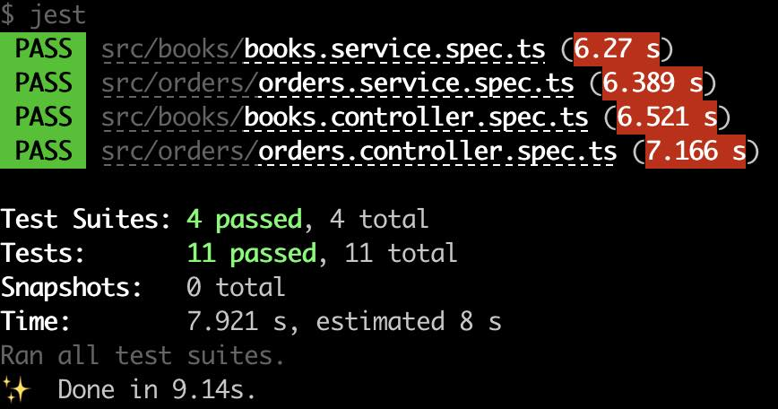
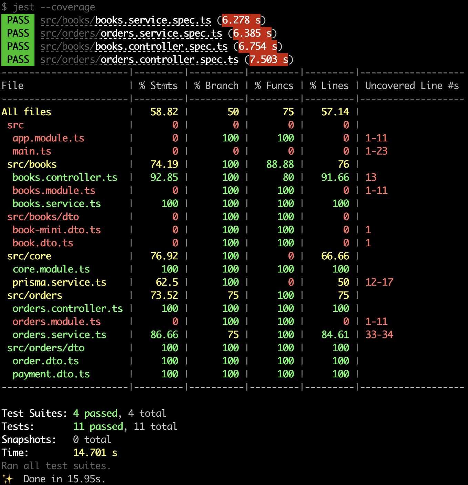
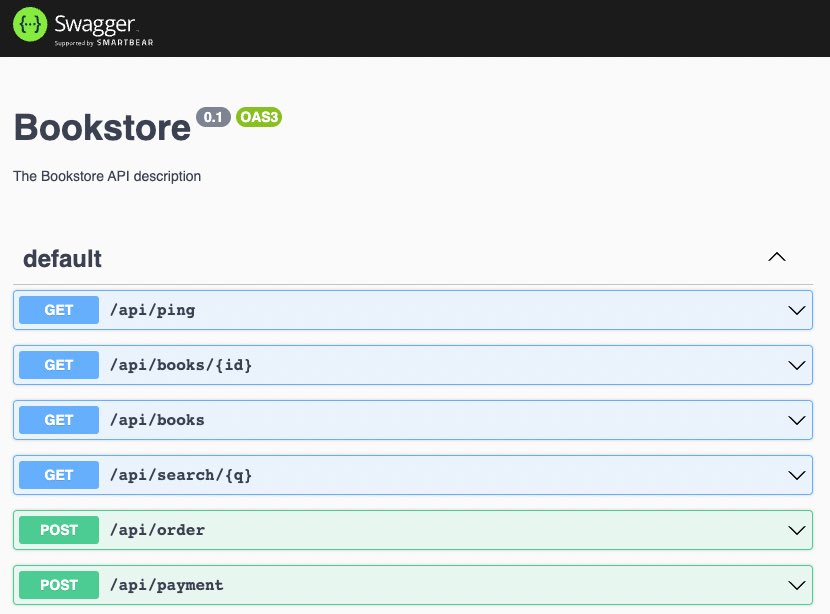
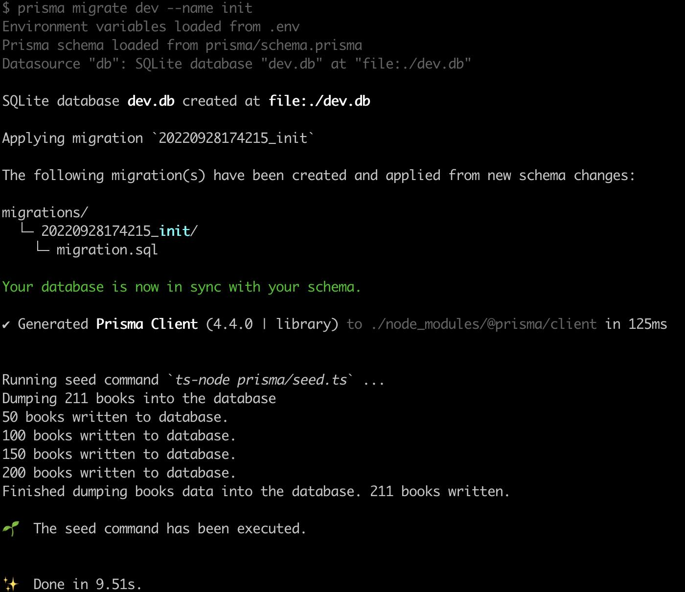

# Bookstore backend

## Description

An example api application using [NestJS](https://nestjs.com),
[Prisma ORM](https://www.prisma.io),
and [sqlite](https://www.sqlite.org).

## Installation

1. Install all dependencies and create an `.env` file using the development template file.  
The `.env` file is not stored in the git repo to avoid keys disclosure.
```bash
npm install
cp .env.develop .env
```
2. Create a database and fill/seed it with initial book data. 
Initial book data is taken from `./books.json` file, which is an extended version of the initial `books.csv` containing attributes like description and book cover.
```bash
npm run seed
```
To view/manage the local SQLite database it is recommended to use software like [DB Browser for SQLite](https://sqlitebrowser.org/)

<br />  
<hr>

## Running the app
#### Development
```bash
npm run start
```

#### Watch mode
```bash
npm run start:dev
```

#### Production mode - firewall restrictions for port 80 must be disabled
```bash
npm run start:prod
```

## Test

#### Unit tests
```bash
npm run test
```


#### Check test coverage
```bash
npm run test:cov
```


## API Documentation

#### Automatically generated API documentation
An openapi (formerly known as swagger) documentation is automatically created using the `@nestjs/swagger` module as described in the [NestJs OpenAPI](
https://docs.nestjs.com/openapi/introduction) documentation.

While the application is running, open your browser and navigate to http://localhost:3000/api  
You should see the Swagger UI.  
To generate and download a Swagger JSON file, navigate to http://localhost:3000/api-json


### API Endpoints
The api endpoints described in the following are fully available.
The api uses the books `ID` (e.g. `1xdECe1`) to address the stored book entries.

**GET /api/books**<br/>
* Returns all stored minified book records from the database to populate on the landing page
* In case no books are found a status 200 with empty array is responded

**GET /api/books/:id**<br/>
* Returns the book matching the `:id`
* In case no book is found a status 200 with empty body is responded

**GET /api/search/:q**<br/>
* Returns all books matching the search query `:q`.
* To find match, books title, author, description, publisher, ISBN, genre, category properties are evaluated.
* In case no books are found a status 200 with empty array is responded

**POST /api/payment**<br/>
* Receives a payment object used to create payment intent with Stripe.
* Requires a valid **Stripe Secret Key** to be present in the `.env` file.
* In case the request is successful, a status 200 with client secred body is responded

**POST /api/order**<br/>
* Receives an order object and adds it to the database.

**GET /api/ping**<br/>
* Returns `pong` to indicate that backend API is up and running


## Limitations and ToDos

#### Paginated output for book entries
The `/books` endpoint should have pagination enabled to limit the response size and reduce fetching time

#### API parameter validation
The input values of the api parameters are currently not validated. There should be input parameter validation for endpoints like `/payment` and `/order`

#### e2e tests using `supertest`

#### Database
The books-api app uses [prisma](https://www.prisma.io/) as database abstraction layer.
For test and develop purposes a SQLite database is used.
In a production environment the SQLite database can easily be replaced with a
[PostgreSQL, MySQL, MongoDB or other database types](
https://www.prisma.io/docs/reference/database-reference/supported-databases).

The Prisma model doesn't use a database specific index for the books 'ID' attribute
to speed up fuzzy text search. In a production environment
this may soon result in performance issues. When performance issues are adressed the model should be extended to use such an index.
Examples: [SQLite FTS5](https://www.sqlite.org/fts5.html) or [PostgreSQL gist indexes](
https://www.alibabacloud.com/blog/postgresql-fuzzy-search-best-practices-single-word-double-word-and-multi-word-fuzzy-search-methods_595635).

#### Logger configuration
The logger configuration is currently located in `src/main.ts`.
The definition must be done in the `.env` file.

## How this project has been generated
The project structure and boilerplate code of this project has been created using the NextJS
cli. This is how it works respectively what has been done:

#### Create project folder
In your local develop folder the new nest app project folder will be created by nestjs.
Additionally all needed dependencies will be installed. 
There is no need to install NestJS to do this because `npx` will download the `NestJS cli` before it is executed.
Choose the package manager according to your needs. In the following `npm` was used.
```bash
npx @nestjs/cli new <app-name>
cd <app-name>
```

#### Create resources for BOOKS and ORDERS
Generate the API resource for the books. Choose transport layer 'REST API' and CRUD generation.
```bash
npx nest generate resource books
```

#### Database binding
This project uses SQLite and Prisma as described in the [NestJS Prisma recipe](
https://docs.nestjs.com/recipes/prisma).
```bash
npm install prisma --save-dev
```
Add peer dependencies<br/>
```bash
npm install class-validator class-transformer --save-dev
```
Create an initial prisma folder and files
```bash
npx prisma init
```
Now edit the file `prisma/schema.prisma` to look similar to the following

    // This is your Prisma schema file,
    // learn more about it in the docs: https://pris.ly/d/prisma-schema

    datasource db {
      provider = "sqlite"
      url      = env("DATABASE_URL")
    }

    generator client {
      provider = "prisma-client-js"
    }

    model Book {
      id            String @id @unique
      title         String
      author        String
      ...
    }

And set the DATABASE_URL variable in the `.env` file in the project root:

    DATABASE_URL="file:./dev.db"

Generate the initial sql migration files and apply them to our SQLite db.
```bash
npx prisma migrate dev --name init
```
or by executing a script
```bash
npm run seed
```



The model specific CRUD database interface is generated.
On future model changes it is required to call `npx prisma generate` manually to obtain an updated database interface.

The content of `./books.json` will be automatically dumped into the database after database initialization. This is controlled by additional configuration setting in the `package.json` file
```bash
  "prisma": {
    "seed": "ts-node prisma/seed.ts"
  }
```
The prisma seed command calls the script in the file `prisma/seed.ts` which loads data. The `seed.ts`
script is also called every time the database is reset using `npx migrate reset`. More details are described in the
[Prisma seed database documentation](https://www.prisma.io/docs/guides/database/seed-database).
  
<br/>  
<br/>  
